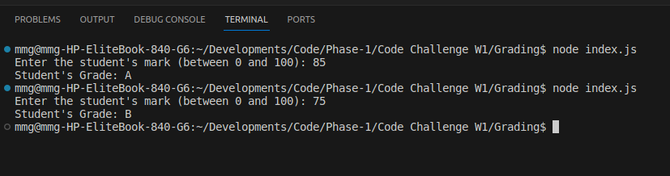

# TOY PROBLEMS
- The language used to make the programs below was Javascript.
- Each challenges code is written in two seperate files (front end and back end ). One file that prompts the user to input giving output and the other file that performs the calculations.

## Challenge 1: Student Grade Generator (Toy Problem)
- In this challenge we are tasked to create code which calculates the grade of students based on the marks inputed.
- The criteria used is:
```sh
     A > 79, B - 60 to 79, C -  59 to 49, D - 40 to 49, E - less 40.
```
- Here is an example of how the code works:




## Challenge 2: Speed Detector (Toy Problem)
- In the second challenge we are tasked to create a program that checks the speed inputed and return "Ok" if the speed is below or equal to 70 and if above git demerits depending on the speed inputed.
- If its above 12 demerit points its suspended.
- This is the createria used:
```sh
 if the speed is 80, it should print: “Points: 2”. If the driver gets more than 12 points, the function should print: “License suspended”.
```
- Here is an example of when a speed less than 70 is inputed:


- Here is an example of the output when a speed above 70 is inputed:


## Challenge 3: Net Salary Calculator (Toy Problem)
- In this challenge we are tasked with creating a system calculates the net salary of an individual by individual when he/she inputs their basic salary and benefits.
- The system calculates the tax, NHIF deductions, NSSF deductions and deducts them for the gross salary to return the net income.
- All necesarry information used in creating the program was obtained in:
[Link to source](https://www.aren.co.ke/payroll/taxrates.htm)
- Here is an example of how the code works:

